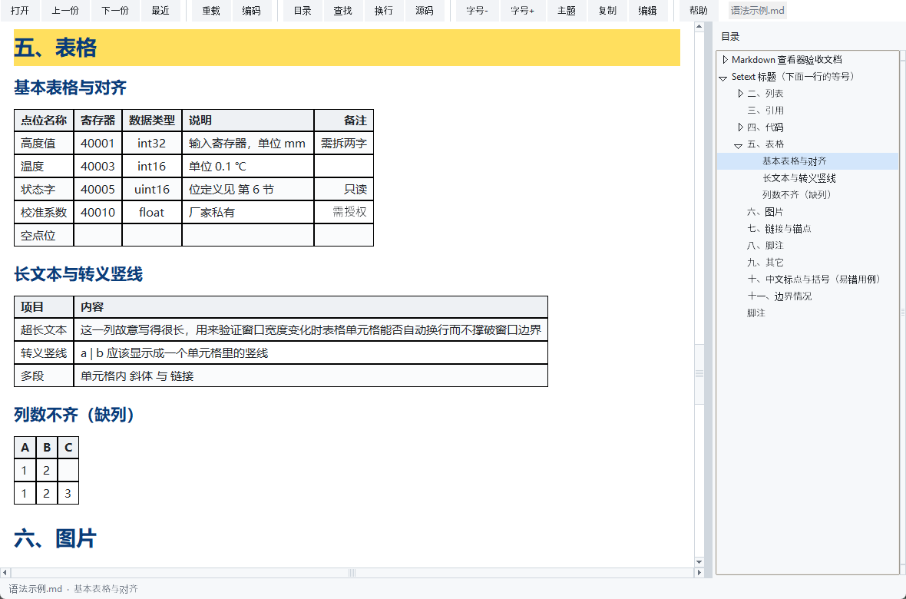

# mdview —— 本地 Markdown 查看器

一个**单文件、零依赖**的 Markdown 阅读器：只用 Python 自带的 tkinter，不装任何第三方库，不联网，不上传任何内容。适合把 `.md` 说明文档、点表、脚本注释直接按格式看起来，而不是在编辑器里读一屏星号和井号。



## 环境要求

- Windows（已在 Windows 10/11 + Python 3.9.1 上验证）
- Python 3.7 及以上，带 tkinter（官方安装包默认自带；若报 `No module named tkinter`，重新运行安装器并勾选 *tcl/tk and IDLE*）

“编辑”按钮、右键菜单脚本、`os.startfile` 打开附件这几处是 Windows 专用逻辑；其它系统未做适配。

## 开始使用

1. 下载 [mdview.pyw](mdview.pyw)
2. 双击它 → 打开上次的文件；或把任意 `.md` 文件**拖到 `mdview.pyw` 图标**上
3. 也可以在命令行里带多个文件/目录：

```bat
pythonw mdview.pyw 说明.md 变更记录.md
pythonw mdview.pyw D:\项目文档
```

想让它出现在 `.md` 文件的右键菜单里：双击 [install_md_menu.bat](install_md_menu.bat)。

- 只写当前用户的注册表 `HKCU\Software\Classes\SystemFileAssociations\...`，**不改动 `.md` 的默认打开方式**
- 不需要管理员权限；菜单没出现就在资源管理器按一次 F5
- 反悔了就跑 [uninstall_md_menu.bat](uninstall_md_menu.bat)

## 快捷键与工具栏

| 操作 | 键 |
| --- | --- |
| 打开文件 | `Ctrl+O` |
| 重新读取（自动判断编码） | `F5` |
| 查找（回车下一个，Shift+回车上一个） | `Ctrl+F` |
| 字号加减 | `Ctrl +` / `Ctrl -`，或 `Ctrl+滚轮` |
| 同目录上一份 / 下一份 | `Alt+←` / `Alt+→` |
| 整页上下翻 | `PageUp` / `PageDown` |
| 全屏 | `F11` |
| 复制选中文字（没选中则复制全文） | `Ctrl+C` |
| 关闭 | `Ctrl+W` 或 `Esc` 先退全屏/关查找条 |
| 帮助 | `F1` |

工具栏：**打开 / 上一份 / 下一份 / 最近 / 重载 / 编码 / 目录 / 查找 / 换行 / 源码 / 字号- / 字号+ / 主题 / 复制 / 编辑 / 帮助**

- **编码**：中文乱码时点一下，按 utf-8 → gbk → big5 → utf-16 → latin-1 循环切。正常打开时程序会自己嗅探（BOM、GBK 中文、乱码率都会算）。
- **换行**：关掉后长行不折行，配合底部横向滚动条看缩进敏感的表格。
- **源码**：切回原始 Markdown（等宽、不折行），用来核对哪段没生效。
- **目录**：左侧标题树，点击跳转；正文滚动时会自动高亮当前小节。

链接可以直接点：网址交给默认浏览器，`#锚点` 在文内跳转，图片/附件用系统关联程序打开。鼠标悬停会显示真实地址。

## 支持的语法

| 类别 | 写法 |
| --- | --- |
| 标题 | `#` 到 `######`，以及下方 `===` / `---` 的下划线式标题；`{#锚点名}` 可自定义锚点 |
| 行内 | **粗体**、*斜体*、***粗斜体***、~~删除线~~、==高亮==、`行内代码`、`\*转义` |
| 列表 | 无序 `- * +`、有序 `1.` / `1)`、任意层嵌套、任务列表 `- [x]` |
| 引用 | `>` 可嵌套，里面还能放列表和代码块 |
| 代码 | ``` 围栏 + 语言标注，缩进 4 空格也认 |
| 表格 | GFM 管道表格，支持 `:---`、`:---:`、`---:` 对齐与 `\|` 转义 |
| 图片 | ``，独占一行时单独成块 |
| 链接 | `[文字](地址 "标题")`、`<https://…>`、裸 URL、`[文字](#锚点)` |
| 脚注 | 正文 `[^标签]`，定义 `[^标签]: 内容`，自动编号并收进文末“脚注”一节 |
| 其它 | `---` 分隔线、YAML 头部元信息、原始 HTML 块 |

代码着色覆盖 Python、C/C++、Java、JS/TS、Shell/BAT/PowerShell、SQL、YAML、JSON、Pascal/Delphi、Lua：关键字、字符串、注释分三种颜色，`#include`、`#define` 这类预处理指令不会被当成注释。

完整示例见 [samples/语法示例.md](samples/语法示例.md)，另有两个编码测试副本 [编码_gbk.md](samples/编码_gbk.md)、[编码_utf8bom.md](samples/编码_utf8bom.md)。

## 已知限制

- **只读**。任务列表的勾选框只做显示，不能点着改文件。
- 表格按真实控件绘制：单元格只能整体加粗或等宽，不支持一格内混排多种样式；窗口太窄时自动降级成纯文本行。
- 正文里源文件的每次换行都按换行渲染，所以“行尾两个空格”的硬换行和普通换行看起来一样。
- 原始 HTML 块以灰色小字显示原文，不做渲染；`<br>`、`<span>` 这类行内标签会被当作排版处理掉。
- PNG / GIF / BMP / PPM 直接显示；**JPG、WEBP 需要装 Pillow**（`pip install pillow`），没装时显示一行提示而不是崩掉。
- 性能：本机 Python 3.9 实测，6000 行文档首次渲染约 0.4 秒，之后连续滚动平均 6 ms 左右一格，日常翻阅不觉得卡。

## 配置与调试

设置存在 `%APPDATA%\mdview\settings.json`（字号、主题、目录是否显示、是否折行、最近 15 个文件）。删掉这个文件就回到默认。

想看解析结果，不用开界面：

```bat
python mdview.pyw --dump 某份文档.md
```

会逐行打印每个块的类型（`H2`、`P`、`LI`、`CODE`、`TBL`、`IMG`、`FOOT`…），排查“为什么这段没按格式显示”很有用。

## 目录结构

```
.
├── mdview.pyw              # 程序本体，单文件
├── install_md_menu.bat     # 添加 .md 右键菜单（HKCU，可卸载）
├── uninstall_md_menu.bat   # 移除该菜单项
├── samples/
│   ├── 语法示例.md          # 全语法验收文档
│   ├── 编码_gbk.md          # GBK 编码测试
│   ├── 编码_utf8bom.md      # 带 BOM 的 UTF-8 测试
│   └── pic/                # 示例图片
└── docs/screenshot.png
```

## 打包成 exe（可选）

本机装了 PyInstaller 就能离线打包，代码不用改：

```bat
python -m PyInstaller --noconsole --onefile --name mdview mdview.pyw
```

`--onefile` 出单个 exe，但每次启动要解压到临时目录，工控机上的杀软对这类打包程序容易误报；在意启动速度和误报就改用 `--onedir`（连同目录一起拷）。
