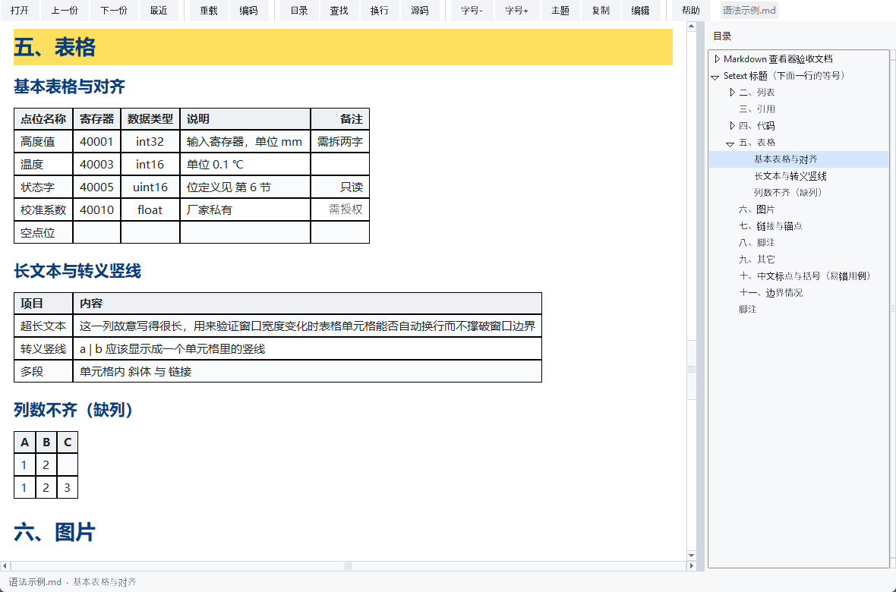

# mdview —— 本地 Markdown 查看器

一个**单文件、零依赖**的 Markdown 阅读器：只用 Python 自带的 tkinter，不装任何第三方库，不联网，不上传任何内容。适合把 `.md` 说明文档、点表、脚本注释按格式看起来，而不是在编辑器里读一屏星号和井号。

程序本体是 `mdview.pyw`（约 2460 行，UTF-8 无 BOM），除标准库外不 import 任何东西；图片走 Pillow 是**可选**的，没装只是显示一行提示，不会崩。



**是**：只读查看器 + 目录跳转 + 表内查找 + 编码嗅探 + 浅色/深色两套主题。
**不是**：编辑器（没有保存功能）、HTML 渲染器、图床客户端、公式排版器。

---

## 环境要求

| 项目 | 说明 |
| --- | --- |
| 系统 | Windows 10/11（作者在 3.9.1 上验证）。"编辑"按钮、右键菜单脚本、用系统关联程序打开附件这三处是 Windows 专用逻辑，其它系统未做适配 |
| Python | 任一自带 tkinter 的 Python 3 都行；官方安装包若报 `No module named tkinter`，重跑安装器并勾选 *tcl/tk and IDLE* |
| Pillow | 可选。装了才能看 JPG / WEBP / BMP / TIF；没装时这几张图显示一行提示 |
| 字体 | 优先用 微软雅黑 UI / 微软雅黑 / Segoe UI，等宽优先 Consolas / Cascadia Mono；系统里没有就回落到 tkinter 默认字体和 Courier New |

---

## 开始使用

程序接受"文件 / 目录"参数，五种入口按顺手程度排：

1. **双击 `mdview.pyw`** —— 打开上一次看的那份文件；没有历史记录则显示内置欢迎页（欢迎页自带表格、任务列表、脚注、图片示例，可以拿来试各种语法）。
2. **把 `.md` 文件拖到 `mdview.pyw` 图标上** —— 走的是命令行参数，等效于第 3 条。⚠️ **拖到已经打开的窗口里没有反应**，程序没做窗口内拖放。
3. **命令行带文件或目录**：

   ```bat
   pythonw mdview.pyw 说明.md 变更记录.md
   pythonw mdview.pyw D:\项目文档
   ```

   - 带多个文件时，`Alt+←` / `Alt+→` 在**这一批文件**里循环；只带一个文件时，这两个键改成在**该文件所在目录**里循环。
   - 目录只展开**一层**（不递归），收进来的扩展名是 `.md .markdown .mdown .mkd .txt`。
   - 相对路径按**当前工作目录**解析，不是按 `mdview.pyw` 所在目录。
   - 路径不存在、目录里没有匹配文件，都会被**静默跳过**（不弹错），界面照常开欢迎页。
   - 任何以 `-` 开头的参数会被直接忽略，包括文件名恰好以 `-` 开头的情况。
4. **`.md` 右键菜单** —— 双击 `install_md_menu.bat`（详见下面「右键菜单脚本」）。
5. **程序内 `Ctrl+O`** —— 打开对话框，过滤器给了 Markdown / 文本 / 所有文件三档，初始目录落在当前文件所在目录或主目录。

---

## 界面结构

从上到下三块：工具栏（+ 查找条，出现时插在工具栏和正文之间）、正文/目录分栏、状态栏。没有菜单栏，也没有右键菜单。

### 工具栏（从左到右，标签原文）

`打开` ｜ `上一份` `下一份` `最近` ｜ `重载` `编码` ｜ `目录` `查找` `换行` `源码` ｜ `字号-` [字号下拉框] `字号+` `主题` `复制` `编辑` ｜ `帮助` `文件名`

- 分组之间用竖线隔开；最右边那块**只显示文件名**（不含目录），完整路径看状态栏。
- 鼠标停在按钮上 0.45 秒会浮出提示，里面写了对应快捷键。
- `源码` 按钮按下后文字会变成 `渲染`，再点回来。
- `换行` 关掉之后长行不再折行，配合正文底部的横向滚动条看缩进敏感的表格。切换时不重排文档，视线停在原来那一行。
- `复制` 复制的是**原始 Markdown 文本**（不是渲染后的排版结果），方便你把带标记的原文贴回编辑器。
- `编辑` 依次找 `code` → `code.cmd` → `notepad++` → `notepad.exe`，都找不到就交给系统默认程序打开。程序本身不改文件、也没有保存功能。
- `最近` 点下来是一个弹出菜单：条目只显示文件名，空列表显示"（还没有最近文件）"，有内容时底部多一条"清空最近文件列表"。

### 正文与目录

- 左右两块在一个可拖拽的分栏窗格里（分隔条 6 像素宽）。**标题目录显示在正文右侧**：代码里两块面板的变量名叫 `right`（正文）和 `left`（目录），但 tkinter 的分栏是按添加顺序从左往右排，正文先添加所以占了左边。工具栏提示里写的"左侧目录"是这个变量的旧说法，实际位置以界面为准。
- 目录树各级标题**只靠缩进区分**，没有做不同字号/颜色；标题为空时显示"（无标题）"；所有节点默认展开。
- 目录面板可以整个收起来（`目录` 按钮），收起状态会被记住。
- 正文字体大小 = 你选的正文字号（7~32），标题字号在 `26/20/16/13/12/11` 的基础上跟着正文字号一起加减，所以放大正文也会放大标题。

### 状态栏（同一条，会被覆盖）

| 时机 | 内容 |
| --- | --- |
| 刚打开/重载完 | `绝对路径    大小    编码名    N 行    渲染 N ms`（大小按 B / KB / MB 取一位小数；字段之间四个空格） |
| 正文滚动过 | 变成 `文件名  ·  当前小节标题` —— **详细信息这时就没了**，重新载入才会再出现 |
| 各种提示/报错 | 见「提示文案」一节 |

### 窗口

- 标题：初始 `Markdown 查看器`，成功打开文件后变成 `文件名 - Markdown 查看器`；欢迎页和打开失败时标题不变。
- 初始尺寸 1180×780，最小 520×320。**窗口大小和位置不记忆**（配置里没有这一项）。
- `Ctrl+W` 或点关闭按钮直接退出，没有"确认保存"这一步（本来就不写文件，设置是即时落盘的）。

---

## 快捷键

程序内不显示快捷键表以外的说明，按 `F1` 可以看同样的一份。

### 全局（焦点在任意控件都生效）

| 键 | 作用 |
| --- | --- |
| `Ctrl+O` | 打开文件对话框 |
| `Ctrl+F` | 弹查找条并聚焦，已有内容会全选方便直接改 |
| `Esc` | 三级优先：退出全屏 → 关查找条 → 清掉跳转高亮 |
| `Ctrl+W` | 退出程序 |
| `F5` | 重新读取，并**重新嗅探编码** |
| `F11` | 全屏开/关 |
| `F1` | 帮助窗口（也可点工具栏的"帮助"） |
| `Ctrl +` / `Ctrl -` | 字号 ±1。`Ctrl+=` 和小键盘的 `Ctrl++` / `Ctrl+-` 同样认，笔记本键盘不用按 Shift |
| `Alt+←` / `Alt+→` | 上一份 / 下一份 |
| `PageUp` / `PageDown` | 整页上下翻 |
| 滚轮 | 每格滚 3 行 |
| `Ctrl+滚轮` | 字号 ±1 |

### 只在正文上生效

| 键/鼠标 | 作用 |
| --- | --- |
| 单击 | **只有带链接样式的文字**会响应；点在普通文字上没动作 |
| 悬停 | 链接上出现手形光标并浮出真实地址（截断到 400 字，4 秒自动消失）；图片上悬停显示路径 |
| `Ctrl+C` | 有选区复制选区；**没有选区时复制整份原始 Markdown** |
| `PageUp` / `PageDown` | 也绑在这里 —— 必须绑在控件上才能压掉 tkinter 自己的翻页，否则会翻两倍 |
| 窗口宽度变化 | 变化小于 30 像素忽略，之后 0.32 秒防抖再整篇重排（分隔线长度、图片缩放、表格列宽都按新宽度重算） |

### 查找条内

`回车` / 小键盘回车 → 下一处；`Shift+回车` → 上一处；边打字边搜（0.2 秒防抖，回车和 Shift/Ctrl 的按下不触发）。

### 没绑的键（避免误以为有）

右键菜单、中键、双击、`Ctrl+A` 全选、`Ctrl+S` 保存、`Home`/`End`、窗口内拖放。方向键走 tkinter 文本控件的默认行为。

---

## 支持的语法

验收文档是 `samples/语法示例.md`（它自己就是按全部语法写的），另外两份 `编码_gbk.md`、`编码_utf8bom.md` 是同一内容的不同编码副本，用来试编码嗅探。下面每类都写了"能做什么"和"会踩的坑"。

### 标题

| 写法 | 结果 |
| --- | --- |
| `#` 到 `######` | H1~H6。`#` 后面必须有空格，`#无空格` 算普通段落；行首最多三个空格 |
| `####### 七级` | **不是标题**，按段落原样显示（实测） |
| 上一行文字 + 下一行 `===` / `---` | 下划线式标题：`=` → H1，`-` → H2 |
| `## 标题 ##` | 结尾的井号会被剥掉，得到"标题"（实测）。反过来说：**以 `#` 结尾的标题文字没法表达** |
| `## 标题 {#my-anchor}` | 自定义锚点，只认 `\w - : .` 这些字符，且**只对 `#` 式标题生效**，下划线式标题不认（实测 `{#a b}` 带空格就不识别） |

不写 `{#id}` 时的锚点规则：去掉标点和特殊符号（保留中文、字母数字、空格和连字符）→ 转小写 → 空格串换成 `-` → 空了就用 `sec` → 重名追加 `-1`、`-2`。所以中文标题"六级"的锚点是 `六级`，"Setext 一"是 `setext-一`。

标题里的行内样式：**粗体不再有额外效果、斜体不生效**（标题已经整体加粗），行内代码只有底色没有等宽字体；删除线和高亮在标题里是生效的。

### 段落与换行

- 源文件里段内的**每一个换行都会渲染成换行**，所以"行尾加两个空格"的硬换行和普通换行看起来一模一样（行尾空白会被剥掉，实测）。
- **制表符一律先替换成 4 个空格**，包括代码块内部的制表符。
- 行尾的反斜杠会被吃掉一个。

### 列表

- 无序用 `-` `*` `+`，有序用 `1.` 或 `1)`（序号最多 9 位）。标记后**必须至少一个空格**：`- [x]done` 会被当成普通条目、正文里保留 `[x]done`（实测）。
- 有序列表的编号**原样保留**，不重排（实测 `5.` 显示 5.）；`1)` 会被归一成 `1.`（实测）。
- 嵌套不限层数，但**所有层的项目符号都是 `•`**（代码里备用了一套 `◦ ▪ ·`，实际调用路径传的是固定层级，那三个字形用不到）。层级的视觉区分只有缩进（每层 22 像素）。
- 只要某项里嵌了子项或代码块，这个列表整体就按"松散"排版（项与项之间多一截间距）。
- 任务列表 `- [x]` / `- [X]` / `- [ ]` 分别画 `☑`（灰色+删除线）/`☑`/`☐`。**只是字形，不能点，也不会回写文件。**
- 列表项里可以再放代码块、引用、表格、多个段落。
- ⚠️ 已知坑：紧挨着的两个列表可能被并成同一个块（缩进跟踪会吞掉后续同级项）。

### 引用

- `>` 可任意层嵌套，每层再加 30 像素左缩进并带底色。
- **懒延续**：引用块里下一行不带 `>` 也会并进来（实测两行合成一段）。
- 引用里可以放列表、代码块、表格、分隔线。

### 代码

| 语法 | 细节 |
| --- | --- |
| ``` 或 ~~~ 围栏 | ≥3 个字符，行首最多 3 空格；结束围栏要同种字符且不短于起始，尾随空格允许。**没闭合就一路吞到文档末尾**（实测） |
| 语言标注 | ```python{X} 这种会被切开，代码块上方多一行题注显示 `python X` |
| 缩进 4 空格 | **仅当它不在一个段落的延续位置时**才算代码块（实测：`段落二` 下面紧挨 `    四空格续行` 会并成同一段落，不是代码块）。`samples/语法示例.md` 里"三个空格不是代码块 / 四个空格是代码块"两行相邻，因此那句自述和实际表现不符，中间空一行才成立 |

着色只有三类：**注释**（斜体灰）、**字符串**、**关键字**。数字不着色。

语言关键字表（按标注归一后取族，大小写不敏感）：

| 语言族 | 认的标注 | 关键字量 |
| --- | --- | --- |
| Python | `py` `python` | 36 |
| Shell | `sh` `bash` `shell` `console` `zsh` `bat` `batch` `dos` `cmd` `powershell` `ps1` | 32 |
| C 系 | `c` `h` `cpp` `cc` `cxx` `hpp` `cs` | 43 |
| Java 系 | `java` `kotlin` `scala` | 40 |
| JS 系 | `js` `javascript` `ts` `typescript` `json` | 38 |
| Pascal | `pascal` `delphi` `pas` | 31 |
| SQL | `sql` | 45 |
| Lua | `lua` | 22 |

- 标在表里的语言才有 `html` `xml` `ini` `txt` 等写法会**没有关键字色**（只剩注释和字符串有色）；**`yaml` / `yml` 不在表里**，`python3` 也不在表里（这两个标注实测关键字数为 0）。`json` 借用的是 JS 关键字，对 JSON 内容基本不起作用。
- 注释识别与语言无关：`#`（但 `#include` `#define` `#ifdef` `#pragma` 这类预处理指令**不会**被当成注释，实测）、`//`、`--`（**要求后面有空格**，`--无空格` 不算）、`REM`（**只认大写**）。`/* 块注释 */` 不支持。

### 表格（GFM 管道表）

- 表头行要含 `|`，下一行必须是分隔行，而且**两者的列数必须完全相等**：`| A | B | C |` 配 `| - | - |` 会让这三行**全部退化成灰色原文**（实测）。
- 分隔格支持 `:---`（左）、`:---:`（中）、`---:`（右）。
- 单元格里的 `\|` 是转义的竖线。
- 数据行不足列数补空、超出列数截断；遇到空行、不含 `|` 的行，或遇到另一个块起始行（`#` 标题、分隔线、列表、围栏）就结束。
- 表格是用真实控件画的（每格一个标签），不是文本，因此：
  - 单元格样式只有两种极限：**整格加粗**（表头恒粗）或整格等宽；格内链接**不可点击**也不高亮，斜体/高亮会丢；
  - **表格里的文字不参与查找，也不能选中复制**（不在正文缓冲区里）；
  - 列宽按当前字体实测分配；可用宽度不够时（约 `(列数+1)×64` 像素）整张表**自动降级成纯文本行**：表头加粗 + 一行短横线，各列用两个空格分隔。

### 图片

```

```

- **只有独占一行、且那一行只有一处图片语法时才画成图块**；写在句子中间的图片只显示 alt 文字（实测：`前文  后文` 出来的是"前文 内联 后文"，没有图、不可点）。块图的 alt 为空时会回落成整个地址。
- 直接支持（tkinter 原生）：**PNG、GIF、PPM、PGM**。
- 其它格式（JPG / WEBP / BMP / TIF / ICO…）需要 Pillow，没装显示一行提示而不是崩。
- 缩放：按可用宽度等比缩（原生格式用整数倍降采样），图片高度超过 1400 像素时再降一档；走 Pillow 的只按宽度缩，没有高度上限。缩过的图会缓存，缓存不清理。
- 图块本身**可以单击**（用系统关联程序打开）、悬停显示路径，下方另起一行显示 alt 文字。
- 失败提示共五种，前缀都是 `图片 <地址> `：

  | 情况 | 文案 |
  | --- | --- |
  | `http(s)://` 等网络地址 | `（网络图片不加载，本地化后仍可显示）` |
  | 需要 Pillow 但没装 | `（该格式需要 Pillow 支持，当前未安装）` |
  | 文件在但读不出来 | `（图片格式不支持或已损坏）` |
  | 文件不存在 | `（文件不存在）` |
  | 地址里有 `#` / `mailto:` / `data:` | `（地址无法解析）`（`data:` 内嵌图不支持，实测落到这条） |

### 链接与点击行为

| 写法 | 支持 | 备注 |
| --- | --- | --- |
| `[文字](地址 "标题")` | ✅ | 标题（title）会被丢弃不显示；地址允许**一层**圆括号、不允许空格 |
| `[文字](<含 空格.md>)` | ⚠️ | 尖括号会被剥掉，但**里面带空格**时整条匹配失败，原样露出 `[b]()` 这种残迹（实测：`[b](<my doc.md>)` → 显示 `[b]()`） |
| `[文字](#锚点)` | ✅ | 文内跳转 |
| 裸 `https://…` / `http://…` | ✅ | 结尾的 `.,;:!?'"。 ，；！？` 会被排除；前面必须是非字母数字且不在 `/-_.` 里 |
| `<https://…>` | ⚠️ | **出现在段落中间才是链接；顶在行首会被 HTML 块规则抢先，渲染成灰色原文且不可点**（实测） |
| `<mailto:a@b.com>` | ❌ | 会被当成 HTML 标签**整段删掉**，文字直接丢失（实测） |
| 邮箱、`ftp://`、`file://` 裸写 | ❌ | 不会自动变链接 |
| 引用式 `[文字][标识]`、`[标识]`、定义行 `[标识]: 地址` | ❌ | 全部按普通段落原样显示（实测） |

点下去之后：

| 地址类型 | 行为 | 状态栏 |
| --- | --- | --- |
| `#锚点` | 文内跳转 | 找不到时：`文内没有这个锚点：<名字>` |
| `http/https/其它带 scheme 的地址`、`mailto:` | 交给系统默认浏览器/邮件程序 | `已用默认浏览器打开：<地址>` 或 `打开失败：…` |
| 本地相对/绝对/UNC/`file:` 路径 | 相对路径按**当前 md 文件所在目录**解析，然后用系统关联程序打开 | `已打开：…` / `找不到：…` |

> ⚠️ 点一个相对路径的 `.md` 链接**不会在本程序里切换**，而是丢给系统的 Markdown 关联程序（可能就是 mdview 另开一个窗口，也可能是别的编辑器）。没有"在当前窗口打开"的逻辑。

### 行内样式

| 语法 | 说明 |
| --- | --- |
| `**粗体**` `__粗体__` | ✅ |
| `*斜体*` `_斜体_` | ✅ |
| `***粗斜体***` | ✅ |
| `~~删除线~~` | ✅；单波浪线 `~x~` 不支持（实测原样） |
| `==高亮==` | ✅（这是扩展写法，不是 GFM 标准） |
| `` `行内代码` ``、`` ``x`` `` | ✅，反引号成对长度不限；里面的换行被压成空格，首尾各一个空格会被剥；**没闭合就当普通文字**（实测） |
| `\*` 转义 | 只认这 20 个字符：反斜杠、反引号、`*` `_` `{` `}` `[` `]` `(` `)` `#` `+` `-` `.` `!` 竖线 `>` `~` `=` `$`。`\:` `\;` `\&` 实测**保留反斜杠原样** |
| `<br>` `<br/>` | 变成换行 |
| 其它行内 HTML 标签 | 直接删掉不留文字 |
| HTML 实体 `&amp;` `&#20013;` | ❌ **不解码**，原样显示（实测） |

强调闭合的两个条件：内容非空、结尾不能是空白。另外 `_` 前面是字母数字或汉字时不当做起始符（所以 `snake_case` 保持原样、`中文**要点**` 正常）。

### 脚注

```
正文里引用 [^标签]
[^标签]: 脚注内容
    缩进四空格的后续行会并入同一条脚注
```

- 编号**按定义出现的先后顺序**，不是按正文里引用的顺序（实测：先引用 `[^b]` 再 `[^a]`，显示时 `[^b]` 是 [1]）。
- 围栏代码块里的 `[^x]: …` 不算定义。
- 文末自动追加：一条分隔线 + H2「脚注」小节 + 各条定义；每条注册成 `footnote-<标签>` 锚点，正文的引用可点过去。
- **没有定义**的引用：编号回落成原标签（显示 `[zz]`），仍然带链接样式，点了提示"文内没有这个锚点：zz"。
- 脚注区没有"返回正文"的反向链接。

### 分隔线与其它

- `---` `***` `___`（以及 `- - -`）→ 分隔线，渲染成**按当前窗口宽度铺满的一行破折号**。
- ⚠️ `---` 紧跟在段落后面时会被下划线式标题抢先，变成 H2（实测），想当分隔线要么空一行，要么用 `***`/`___`。
- **YAML 头部**：要求**第一行恰好是 `---`**，并在 150 行内找到 `---` 或 `...` 收尾；键允许中文、不允许行首缩进，不符合"键: 值"的行按原文收录。渲染成一段 `-------- 文档信息` + 每行 `键：值`。没闭合就整段当普通内容（`---` 于是变成分隔线）。
- **原始 HTML 块**：行首是 `<` 开头的标签时，把连续的非空行整块按灰色小字等宽显示原文，**不做任何渲染**。单独一行的表格残行也会落到这种灰字里。

### 明确不支持的

HTML 实体解码、引用式链接、任何 HTML 标签渲染（`<kbd>` `<u>` `` `<a name>`）、数学公式 `$…$`、任务列表回写、跨行/合并单元格表格、标题自动编号、通用属性 `{.*}`、`.txt` 的纯文本模式、打印与导出 PDF、查找用正则、在程序内点开另一份 `.md`。

---

## 中文乱码是怎么判定的

打开或按 `F5` 时，程序会自己判断编码，规则按顺序：

1. **UTF-16 BOM 优先**：开头是 `FF FE` / `FE FF` 就直接当 utf-16。带 BOM 的 UTF-8 会显示成 `utf-8-sig`。
2. 拿 `utf-8` / `gbk` / `big5` 三种轮流试：先用**前 400000 字节**探一次能不能解，再整文件解；整文件解不动但探针能过的编码**直接淘汰**。
3. 能解的按 `中文字数 × 3 − 乱码替换符数 × 800 + (探针通过 ? 100 : −100000)` 打分取最高（只数前 8000 个字符里的中文）。同分时 utf-8 赢，所以纯 ASCII 文件判为 utf-8。
4. 三种全失败时，再依次用 `utf-8` / `gbk` / `latin-1` 找一个能整解的 —— **latin-1 不参与打分，只兜底**；**没有 BOM 的 UTF-16 永远不会被自动选中**。
5. 还不行就 utf-8 + 替换错误字符（所以极少数情况会看到 `` 而不是报错）。

自动判断错了就点工具栏 **`编码`** 手动切，循环顺序是 `utf-8 → gbk → big5 → utf-16 → latin-1`（当前编码不认识时下一档跳 gbk），切完保持原来那一行不跳位，状态栏提示：

```
编码：gbk（如果中文仍是乱码，继续点"编码"切换）
```

⚠️ 两个小坑：欢迎页（没有文件时）点 `编码` 没有任何反应也没有提示；`--dump` 那条调试路**不嗅探**，固定按 UTF-8 读，GBK 文档 dump 出来是乱码。

---

## 目录跟随与跳转

- 滚动正文时，目录会自动高亮"当前小节"。判定规则：**视口里最靠上的那个标题**；视口里一个标题都没有（正在读长段落中间）时，退回视口上方最近的一个。
- 跟随有 120 毫秒节流，快速滚动不会卡。
- 点目录项会跳过去：目标行被顶到**视口第一行**（文档末尾附近时 Tk 会把滚动条钳住，目标可能偏上几行，但一定在视口里），并给它上一秒的底色高亮（底色和查找命中同色）。连续快速跳转时，前一次的定时器可能把新加的高亮提前清掉。
- ⚠️ 点击"刚刚被自动高亮的那一项"时，程序把它当成回环吞掉、不产生跳转——可能表现为"要点第二次才动"（取决于选择事件派发的顺序）。
- 状态栏在滚动时显示 `文件名  ·  小节标题`。

## 查找

- **子串匹配**，不支持正则与通配；勾"区分大小写"可切换（默认不区分）。
- 打字即搜（0.2 秒防抖），每次搜索都从文档开头重新数；命中数**封顶 4000 处**。
- 高亮分两层：所有命中浅色、当前命中深色；`回车`/`上一个`/`下一个` 在命中之间**循环环绕**。
- 定位时把命中行**上抬 3 行**显示（看得见上下文），并且只有当目标行和当前视口顶行相差 6 行以上才真的滚动。
- 计数文案：`共 N 处`（刚搜完）→ `当前 / 总数` → `没有找到`。
- 窗口重排后会自动按当前关键词重搜一次。
- **搜不到的东西**：表格单元格里的文字、图片、目录项；渲染模式下标记符号（`**`、`[]()`）也不在缓冲区里 —— 想搜原文就切到"源码"模式，那时搜的是原始 Markdown。
- ⚠️ 换文件时查找条不会自动关，也不会自动重搜（旧的命中列表会被清空，按一次回车才重数）。

---

## 提示文案（出问题先看这几句）

| 场景 | 状态栏原文 |
| --- | --- |
| 文件不存在（比如从最近列表点的） | `文件不存在：<绝对路径>` |
| 被占用 / 没权限 | `读取失败：<异常信息>` |
| 编码彻底判不出来 | `无法识别编码，可点"编码"手动切换` |
| 空文件或全是空白 | 正文显示 `（空文件）` |
| 锚点不存在 | `文内没有这个锚点：<名字>` |
| 复制 | `已复制 N 字符` / `已复制全文 N 字符` |
| 编辑 | `已在编辑器中打开：<编辑器>` / `已用系统默认程序打开` / `打开编辑器失败：…` |
| 链接与附件 | `已用默认浏览器打开：…` / `已打开：…` / `打开失败：…` / `找不到：…` |
| 图片 | 见上面那张五种文案表 |

---

## 主题

只有两套：浅色 `light` 和深色 `dark`，界面上不显示名字，按钮就叫"主题"，点一下在两者之间翻。切换会**保持当前行位置**，并即时写进配置。

每套 24 个颜色位（正文/面板/边框/标题/链接/代码底色/引用/表头/斑马纹/完成项/命中/当前命中/目录底色…），要改配色就改 `mdview.pyw` 顶部的 `THEMES` 字典。

已知不一致：深色主题下，**链接悬停气泡**仍是默认的浅色底（那个小标签没跟着主题设色），工具栏提示气泡是跟主题的。

---

## 配置文件

```
%APPDATA%\mdview\settings.json
```

只有六个键，写完就整体重写：

| 键 | 默认 | 作用 |
| --- | --- | --- |
| `font_size` | 11 | 正文字号，读写都会被夹到 **7~32** |
| `theme_name` | `"light"` | 只认 `light` / `dark` |
| `toc_visible` | true | 目录面板是否显示 |
| `wrap_on` | true | 是否折行 |
| `show_src` | false | 打开时是否直接进源码模式 |
| `recent` | `[]` | 最近文件，**只存前 15 条** |

读取时的纠正规则：JSON 坏掉、顶层不是对象 → 整份忽略用默认值；`font_size` 写成小数/字符串/布尔 → 忽略；三个开关不是布尔 → 忽略；`recent` 里**已不存在的文件在读取时就被剔除**；**你不认识的额外键，在下一次保存时会从文件里消失**。

删掉这个文件就回到全套默认。

**配置里没有的**（因此也没法改）：窗口大小与位置、分栏宽度、字体族、外部编辑器路径、快捷键、编码覆盖、当前小节。

---

## 右键菜单脚本

| 脚本 | 做什么 |
| --- | --- |
| `install_md_menu.bat` | 给 `.md` `.markdown` `.mdown` `.mkd` **四种**扩展各写三条当前用户注册表项（`HKCU\Software\Classes\SystemFileAssociations\<扩展>\shell\mdview`），菜单名"用 Markdown 查看器打开"，图标用 `pythonw.exe` 自带的 |
| `uninstall_md_menu.bat` | 把上面那个 `shell\mdview` 整键删掉 |

- **不需要管理员权限**，**不改动 `.md` 的默认打开方式**（用 `SystemFileAssociations` 而不是 ProgID / UserChoice），也不删除 `mdview.pyw`。
- bat 要和 `mdview.pyw` **放在同一个文件夹**，脚本按自己所在目录找程序；找不到会报 `[错误] 本脚本要和 mdview.pyw 放在同一个文件夹里。`
- 找 `pythonw.exe` 时会跳过微软商店的 `WindowsApps` 别名占位，实在找不到就用 `py -3` 问一遍路径；再失败提示先装 Python 并勾选 Add to PATH。
- 菜单没出现就在资源管理器按一次 F5（脚本不刷新外壳缓存，也没处理 Win11 的"显示更多选项"二级菜单）。
- ⚠️ 两个 bat 文件本身是 **ANSI/GBK 编码**（不是 UTF-8），非简体中文系统上回显的中文提示会乱码；`.gitattributes` 里强制 `*.bat` 用 CRLF，改完别用 LF 提交。
- 卸载脚本**不动** `%APPDATA%\mdview\settings.json`（最近文件记录会留着）。

---

## 调试：`--dump`

```bat
python mdview.pyw --dump 某份文档.md
```

逐行打印每个块的类型和行号：`H1` `H2` `P` `LI`（带层级、项目符号、是否任务项）`CODE`（带语言和行数）`TBL` `IMG` `FOOT` `htmlraw` `hr` `quote` 等。排查"这段为什么没按格式显示"很好用 —— 上面表格里那些"实测"结论就是用它验的。

三条限制：`--dump` **必须是第一个参数**；不带文件时它**解析自己的源码**；文件不存在或传的是目录会直接抛 traceback。它不读写配置、不起界面。

想看真正的渲染效果只能开界面。

---

## 性能

- 状态栏那个 `渲染 N ms` 只统计**首次整篇渲染**，程序里没有任何滚动耗时测量。
- 作者本机（Python 3.9）外部实测：6000 行文档首次渲染约 0.4 秒，之后连续滚动平均每格 6 毫秒左右，日常翻阅不觉得卡。这两个数字属于"作者机器上的观察"，不是程序输出的指标。
- 渲染是**整篇重建**式的：改字号、切主题、切源码、切编码、拖窗口宽度都会把整篇重新排版一遍（宽度要变化 30 像素以上，并等 320 毫秒才动手）。**开关折行不算重排**，它只改文本区的折行属性、再把视线拉回原来那一行。
- 排版时量文字宽度（`font.measure`）是一次 Python↔Tcl 往返，同一批空格和单元格文本每次重排都要重新量，所以程序按"字体名 + 字符串"缓存了测量结果；改字号会换字体对象，缓存同时作废。表格单元格也改成先算出一份文本、列宽和控件共用，`parse_inline` 调用量减半。本机（Python 3.14）外部实测：6000 行带表格的文档单次渲染 `measure` 调用从 4.16 万次降到 0，整体耗时降 3%~50% —— 纯列表文档降一半，表格越密降得越少，因为剩下的时间全花在 Tk 建/销毁单元格控件上，那是嵌进文本区的真实控件，省不掉。
- 图片解码缓存封顶 64 张，超出后丢最早的那张（正在显示的不受影响）；表格控件每次重排都整套销毁重建，不会随浏览累积。但一篇文档里的表格是同时存在的，几百行的大表格仍然很占内存，建议关掉折行或直接用编辑器看。

---

## 目录结构

```
.
├── mdview.pyw              # 程序本体，单文件 2503 行
├── install_md_menu.bat     # 添加四种扩展名的右键菜单（HKCU，无需管理员）
├── uninstall_md_menu.bat   # 移除该菜单项（不动 settings.json）
├── samples/
│   ├── 语法示例.md          # 全语法验收文档，11 节
│   ├── 编码_gbk.md          # 同一份内容的 GBK 副本
│   ├── 编码_utf8bom.md      # 同一份内容的 UTF-8 + BOM 副本
│   └── pic/                # demo.png / demo.gif / wide.png（wide.png 目前没被引用）
└── docs/screenshot.png
```

`pic/nope.png` 和 `data/points.csv` 是样本里**故意指向不存在文件**的引用（语法示例第 266、278、308 行），用来验"文件不存在"和"附件找不到"这两条提示。

---

## 打包成 exe（可选）

本机装了 PyInstaller 就能离线打包，代码不用改：

```bat
python -m PyInstaller --noconsole --onefile --name mdview mdview.pyw
```

`--onefile` 出单个 exe，但每次启动要解压到临时目录，工控机上的杀软对这类打包程序容易误报；在意启动速度和误报就改用 `--onedir`（连同目录一起拷）。打包后配置仍然写在 `%APPDATA%\mdview\settings.json`。
（这条命令作者没有实机跑过验证，PyInstaller 对 `.pyw` 单文件 tkinter 程序是常规用法；`.gitignore` 已经忽略 `build/ dist/ *.spec`。）

---

## 与程序内文案不一致的地方（已知，尚未改）

留在这里备忘，代码一个字没动：

1. `目录` 按钮的提示写"显示或隐藏**左侧**目录"，实际面板在正文**右侧**。
2. 程序内帮助（`F1`）列的编码循环只有 4 个，漏了 `latin-1`；工具栏提示和本文件都是 5 个。
3. `samples/语法示例.md` 里"三个空格不是代码块 / 四个空格是代码块"两行相邻，实际第二行会被并进上一段，需要中间空一行才成立。
4. 样本里"行尾两个空格算硬换行"的自述，与实际表现（每个换行都换行）没有区别。
